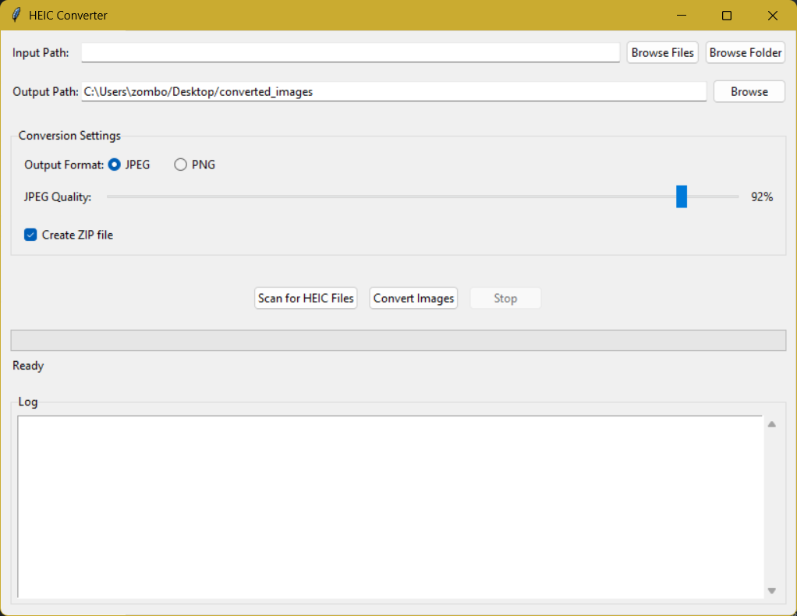

# HEIC Dynamic Wallpaper Extractor

A Python GUI application designed to help Windows users extract individual frames from HEIC dynamic wallpapers. This tool was created to enable Windows users to enjoy dynamic wallpapers similar to those available on macOS, by extracting the individual frames from HEIC files which can then be used with dynamic wallpaper applications on Windows.

## Features

- **User-friendly GUI**: Clean, intuitive interface built with tkinter
- **Batch conversion**: Convert multiple HEIC files at once
- **Multiple input methods**: Select individual files or entire folders
- **Format options**: Convert to JPEG or PNG
- **Quality control**: Adjustable JPEG quality settings (1-100%)
- **ZIP file creation**: Automatically create ZIP files for easy sharing
- **Progress tracking**: Real-time progress bar and status updates
- **Detailed logging**: View conversion progress and error messages
- **Cross-platform**: Works on Windows, macOS, and Linux
- **Offline operation**: No internet connection required
## Screenshots



<p align="center">HEIC Dynamic Wallpaper Extractor</p>

## Installation

### Prerequisites

- Python 3.7 or higher
- pip package manager

### Quick Setup

1. **Download the files**: Save all the provided files to a folder
2. **Run the setup script**:
   ```bash
   python setup.py
   ```
   This will automatically install all required dependencies and create a desktop shortcut.

### Manual Installation

1. **Install dependencies**:
   ```bash
   pip install -r requirements.txt
   ```
   
   Or install manually:
   ```bash
   pip install pillow-heif Pillow
   ```

2. **Run the application**:
   ```bash
   python heic_converter_gui.py
   ```

### Creating an Executable (Optional)

To create a standalone executable:

1. **Install PyInstaller**:
   ```bash
   pip install pyinstaller
   ```

2. **Create executable**:
   ```bash
   pyinstaller --onefile --windowed --name "HEIC Converter" heic_converter_gui.py
   ```

## Usage

### Basic Conversion

1. **Select Input**: 
   - Click "Browse Files" to select individual HEIC files
   - Click "Browse Folder" to select a folder containing HEIC files

2. **Set Output**: 
   - Choose where to save converted files
   - Default: `~/Desktop/converted_images`

3. **Choose Settings**:
   - Select output format (JPEG or PNG)
   - Adjust JPEG quality (1-100%)
   - Check "Create ZIP file" for easy downloading

4. **Convert**:
   - Click "Scan for HEIC Files" to preview files
   - Click "Convert Images" to start conversion
   - Monitor progress in the log area

### Advanced Features

- **Batch Processing**: The application can handle hundreds of files
- **Progress Tracking**: Real-time progress bar and status updates
- **Error Handling**: Continues processing even if some files fail
- **Stop Function**: Cancel conversion at any time
- **Detailed Logging**: View all conversion activities

## File Structure

```
heic-converter-gui/
├── heic_converter_gui.py      # Main GUI application
├── setup.py                   # Automated setup script
├── requirements.txt           # Python dependencies
└── README.md                 # This file
```

## Supported Formats

- **Input**: HEIC, HEIF
- **Output**: JPEG, PNG

## Configuration

The application remembers your last settings including:
- Output directory
- Format preference
- Quality settings
- ZIP file option

## Troubleshooting

### Common Issues

1. **"Missing Dependencies" Error**:
   - Run: `pip install pillow-heif Pillow`
   - Ensure Python 3.7+ is installed

2. **"No HEIC files found"**:
   - Check that files have .heic or .heif extensions
   - Verify the input path is correct

3. **Conversion Errors**:
   - Check that input files are valid HEIC images
   - Ensure output directory is writable
   - Try reducing the number of files processed at once

4. **Slow Performance**:
   - Large files take longer to convert
   - Consider reducing JPEG quality for faster processing
   - Close other applications to free up memory

### Debug Mode

To see detailed error messages, run from command line:
```bash
python heic_converter_gui.py
```

## Dependencies

- **pillow-heif**: HEIC image format support
- **Pillow**: Image processing library
- **tkinter**: GUI framework (included with Python)

## System Requirements

- **RAM**: 512MB minimum, 2GB recommended for large batches
- **Storage**: Enough space for original and converted files
- **OS**: Windows 7+, macOS 10.12+, Linux (any modern distribution)

## Performance Tips

- Convert files in smaller batches for better performance
- Use JPEG format for smaller file sizes
- Close other applications during large conversions
- Use an SSD for faster file I/O operations

## License

MIT License - Feel free to use and modify as needed.

## Contributing

Contributions are welcome! Please feel free to submit pull requests or report issues.

## Changelog

### Version 1.0.0
- Initial release
- Basic HEIC to JPEG/PNG conversion
- Batch processing support
- GUI interface with progress tracking
- ZIP file creation
- Cross-platform support